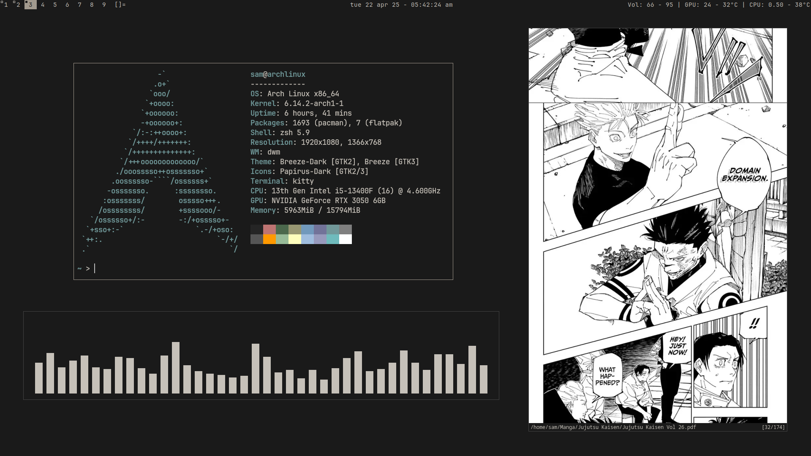

## Preview



## Requirements

- `libx11`, `libxft`, `libxinerama` (X11 development libraries)
- `make`, `gcc`
- `kitty` (used for scratchpad)
- `dwmblocks` (for the status bar)
- `JetBrainsMono Nerd Font`

> If you use a terminal other than `kitty`, you'll need to update `config.def.h` accordingly.

### here is how to install them using pacman from archlinux official repos:
```bash
sudo pacman -S base-devel libx11 libxft libxinerama xorg-server xorg-xinit kitty ttf-jetbrains-mono make gcc
```


  
## Shortcuts

| Keys                            | Action                        |
|---------------------------------|-------------------------------|
| `Mod + s`                       | Toggle scratchpad             |
| `Mod + Shift + Return`          | Zoom (swap with master)       |
| `Mod + j / k`                   | Focus next/previous window    |
| `Mod + Shift + j / k`           | Push window down/up           |
| `Mod + h / l`                   | Resize master area            |
| `Mod + Shift + i / d`           | Change number of master wins  |
| `Mod + Shift + b`               | Toggle status bar             |
| `Mod + Shift + w`               | Toggle fullscreen             |
| `Mod + Shift + q`               | Kill window                   |
| `Mod + , / .`                   | Focus monitor left/right      |
| `Mod + Shift + , / .`           | Send window to monitor        |
| `Mod + [1-9]`                   | View tag                      |
| `Mod + Shift + [1-9]`           | Move window to tag            |
| `Mod + Ctrl + Shift + q`        | Quit dwm                      |
  


## Status Bar

  
This build uses [`dwmblocks`](https://github.com/torrinfail/dwmblocks) for the status bar.

⏵ My custom config for `dwmblocks` is in my [dotfiles/src](https://github.com/5alahaldin/dotfiles/tree/main/src) repo.


## Install

  
```bash
git clone https://github.com/5alahaldin/dwm
cd dwm
sudo make clean install
```

Finaly launch DWM with `startx` or your preferred display manager.
